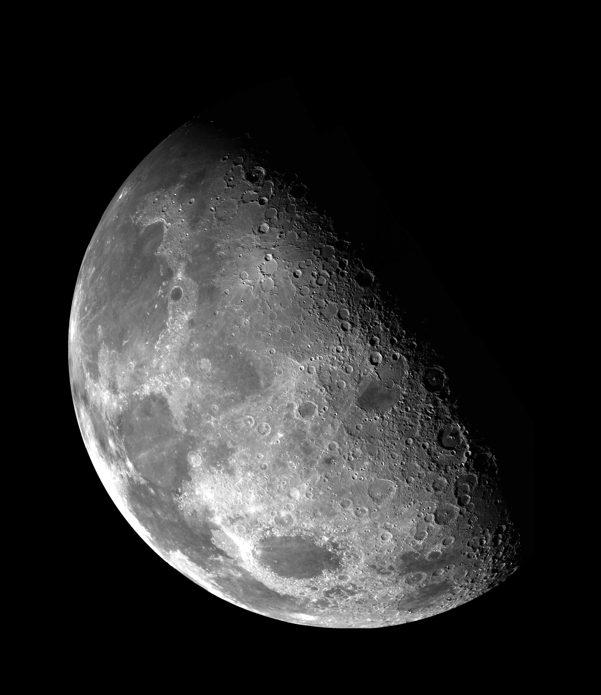
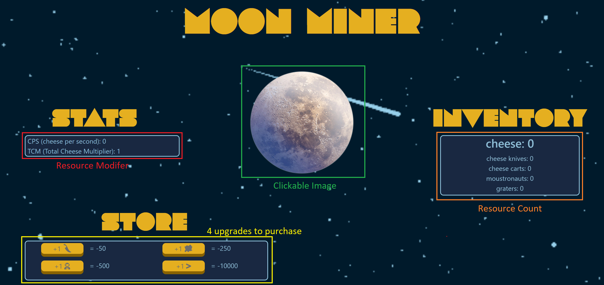

# Moon-Miner


Legend holds that the moon is made of cheese. We sent a team of astronauts and discovered that it was true! It was only a matter of time before mining this treasure became big business. Begin your corporation on their endeavor to mine the moon!

## Goals

In this checkpoint students will demonstrate their understanding of working with the DOM and dynamically rendering data to the page. They will be responsible for writing functions to handle input and styling the page utilizing Bootstrap best practices to design the page.
In this example setup we will give the example of mining cheese from the moon, however make this your own and add whatever creative flair you choose.

## The Setup

### Step 1 - Create page layout and `Mine` element

1. Link Bootstrap, app.js and style.css to index.html.
2. Add an image to your page for the user to click on to 'mine' resources
3. Add an `onclick` attribute that will later be tied to a `mine` function

### Step 2 - Declare variables and write the `mine` function

In the app.js file create a global variable to store the total cheese count and set it to 0

```javascript
let cheese = 0;
```

Create a function called `mine`, the job of this function is to:
- Increase the cheese count by 1
- For now, have the function `alert(cheese)`

### Step 3 - Test

Create a test by calling `mine()` at the end of the app.js file.
- You should see an alert of 1 show on the screen.
- If this is working, remove the test to prevent popups on every page load.
- Add the `onclick` to your image that will trigger your `mine` method, and test that this also creates the alert. Each time you click the picture the count should go up.

### Step 4 - Update the DOM

Add an element to your page that will render the current amount of cheese the user has mined. 
In your app.js, create an `update()` method that will update this element on the screen with the current cheese amount.

> Consider where you want to call this method, at what point should this occur so that the user always has the most up to date information? Once this is working be sure to remove the `alert(cheese)`

### Step 5 - Upgrades

Your game must support a total of 4 upgrades, which must have two types of modifications, one for increasing the value of a click, and one that generates resources automatically. These values can be stored in the global scope as well, but we want to keep them together, so consider using a dictionary for each type of upgrade `clickUpgrades`, `automaticUpgrades`. These dictionaries should contain the number of purchased objects, their price, the multiplier (the more you have of an item the more expensive the price should become):

```javascript
let clickUpgrades = {
  pickaxes: {
    price: 100,
    quantity: 0,
    multiplier: 1
  }
};

let automaticUpgrades = {
  rovers: {
    price: 600,
    quantity: 0,
    multiplier: 20
  }
};
```

#### Purchasing Upgrades

First we want to create the method(s) that will increase the number of items from the upgrades, but it will need to make sure the user has the resources to do so.
Start by making a method `BuyPickaxe()` this method will be responsible for checking if the user has the resources, and if they do increasing the pickaxe purchased count, and decreasing the cheese resources by the appropriate amount. 
once again, in the testing phase we can put in `console.log("purchased")` to confirm that it worked before we have to worry about anything else.
If it consoles appropriately add a count to the page so the user can see how many they have.

#### Pickaxes & Carts

At least one of your purchasable should be a click modifier, for instance for each pickaxe purchased you will +1 to your click. As an example if a user had purchased 4 pickaxes, when they click will add 1+4 to their cheese. Try to have multiple levels of these, where for example a cart may give +4 per cart purchased.

#### Miners & Lunar Rovers

We also want to support the ability for the game to "play" itself. There for we will need to do a few things to support the 'rovers' who mine without the user having to click.
This will require two things:

1. First create a method called `collectAutoUpgrades`, this will iterate over the automaticUpgrades, total the quantity of each `automaticUpgrade` times their multiplier, and add that value to the cheese resource. (See example below)
2. We want this to happen automatically, so we will need to use setInterval ([reference](https://www.w3schools.com/jsref/met_win_setinterval.asp)) to make sure this occurs every three seconds automatically, we can set this automatic invocation like so:

```javascript
function startInterval() {
  collectionInterval = setInterval(collectAutoUpgrades, 3000);
}
```

here the first parameter is not invoked, but passed to be invoked every 3000 milliseconds (3 seconds)

> Don't forget to invoke startInterval 

### Collect Example

Consider this example:

- User has 3 pickaxes and 2 Rovers
- Pickaxe has a modifier of 1
- Rovers have a modifier of 20
- Only Rovers are automatic
- On the automatic interval (2 rovers x 20 rover multiplier) 40 cheese resources will be added.
- On a click (1 click + 3 pickaxes \* 1 pickaxe multiplier) 4 cheese resources will be added.

### Visual Mockup


## Requirements

### Visualization

- [ ] User can click on an image to generate a resource
- [ ] Users have an up-to-date count of their resources
- [ ] Users have at least 4 upgrades to purchase
- [ ] Users can see how many of each resource they have and the amount of modification that resource provides

### Functionality

- [ ] At least 1 click upgrade and 1 automatic upgrade
- [ ] Automatic upgrades are applied at least every 3 seconds, and the screen is updated to reflect this change
- [ ] Users cannot purchase an upgrade if they do not have the resources
- [ ] Upgrades have different modifier values
- [ ] When a user buys an upgrade, the price of the upgrade goes up

## Stretch Goal Ideas

- Instead of a basic count, use images or icons to represent how many of a purchasable the user has
- Prevent the user from writing a loop to click by setting a 'cooldown' between clicks
- Disable the buttons a user cannot purchase and enable them if they have enough money
- Unlock/hide upgrades until the user has enough resources at least once to afford the item
- Consider how you could add bonuses that could increase the multiplier of `automaticUpgrades`
- Try using localstorage to save your game progress between page reloads
- Create a badge system to mark user milestones ex. award "The Collector" for mining 1,000,000 total Cheese
- Create a way to decrease the interval of automaticCollection
- Prevent the collectionInterval from being started more than once
